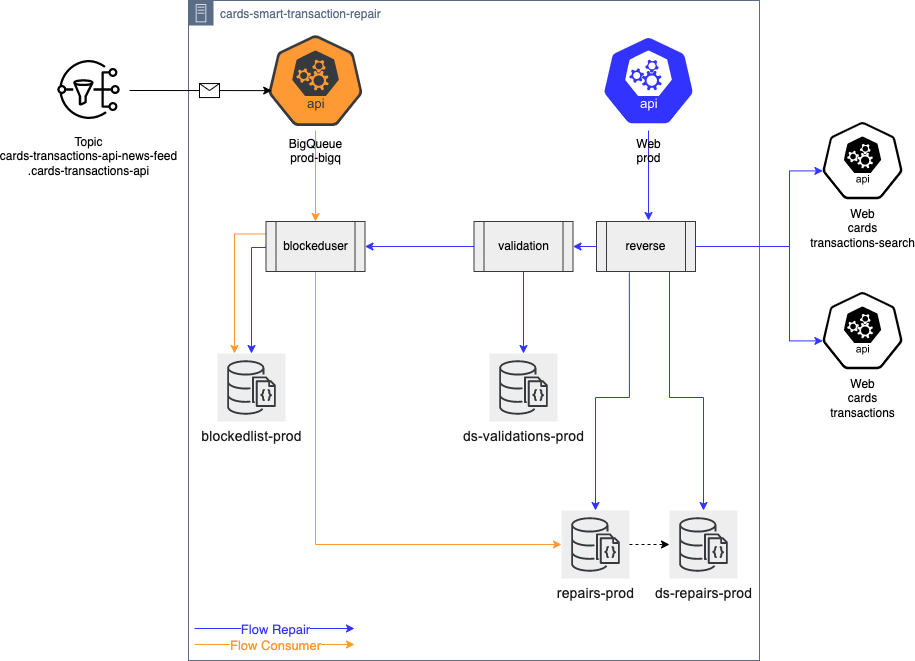

Leia em [Português](README.pt.md)

# Smart Transaction Repair API


## Objective:

It is to allow the user, in a simple and direct way, to request the return of the money of a transaction that was denied, however, charged.

> ### Supported Sites:
>
> | Site | 
> |------------|
> | Mexico (MLM) | 

---

</br>

## Reparation:

The reparations request will undergo validation, with previously defined rules, which will validate the eligibility of the requesting user.


> ### Considered Rules:
>
> | Parameter | Rule
> |----------|-----|
> | max_amount_reparation | the transaction amount must not be greater than the maximum allowed amount |
> | qty_reparation_per_period_days | there is a limit to the number of returns within a day range |
> | status_detail_allowed | transaction status must be within what is allowed |
> | user | the user must not be blocked** |
>

>
> ### Parameterizable Values 
> 
> The defined values that will be used to apply the rules are stored in `json` format within the Fury `Configurations` configuration service, allowing the change of values without the need to change the code.
>
> Json example:
> ``` json
> { 
>   "status_detail_allowed": {
>     "pending_capture": {}
>   },
>   "qty_reparation_per_period_days": {
>     "qty": 2,
>     "period_days": 30
>   },  
>   "max_amount_reparation": 200000
> }
>
> ```
> ** The verification of a blocked user is done directly in the blockedlist database.

---

</br>

## User Blocked:

 The user is blocked when he performs a return and then the transaction capture returned is transmitted to our eco system.

 The verification is done through a consumer of the `cards-transactions-api-news-feed.cards-transactions-api` topic, where for each capture received, the application checks if there is a return associated with the capture through the authorization identifier.

---

</br>

## API

### Environments:
| Environment | Protocol | Host | BasePath
|----------|-----|-|-|
| beta | http | internal.mercadopago.com | /beta/cards/smart-transaction-repair |
| prod | http | internal.mercadopago.com | /cards/smart-transaction-repair |

</br>

### Routes:

### Request a Reparation

> #### POST /v1/reverse/{payment_id}

##### Request Path Parameters

| Parameter | Description |
|-----------|-----------|
| payment_id | payment identifier |

#####  Header

| Parameter | Description |
|-----------|-----------|
| X-Client-Id | requesting application identifier |

</br>

##### Request Body

``` json
{
    "user_id":123
}

```

| Property | Description | Type | Mandatory |
|-------------|-----------|------|------------|
| user_id | identifier of the user requesting the return | int | YES |

</br>

##### 1. Response Body

``` json
{
    "message":"Reverse successfully requested"
}

```

| Property | Description | Type |
|-------------|-----------|------|
| message | return success message | string |

</br>

##### 1.1. Response Body Error

```json
{
    "code": "unauthorized",
    "message": "invalid request",
    "cause": "request is not authorized"
}
```

| Property | Description | Type |
|-------------|-----------|------|
| code | application error code | string |
| message | generic error message | string |
| cause | error reason | string |

</br>

##### 1.2. Response Body Error - Not Eligible

```json
{
    "code": "not_eligible",
    "message": "validation result",
    "cause": {
        "reason": "customer not eligible for reversal",
        "creation_datetime": "2022-12-07T21:46:07.713Z"         
    }
}
```

| Property | Description | Type |
|-------------|-----------|------|
| code | application error code | string |
| message | generic error message | string |
| cause | error details | object |
| cause.reason | generic reparation validation denied message | string |
| cause.creation_datetime | payment creation date | string |

</br>

---

## Architecture


</br>

---
## Sequence Diagram > [workflow](workflow.md?id=sequence-diagram)

</br>

---
## Queries > [examples](queries.md?id=queries)
