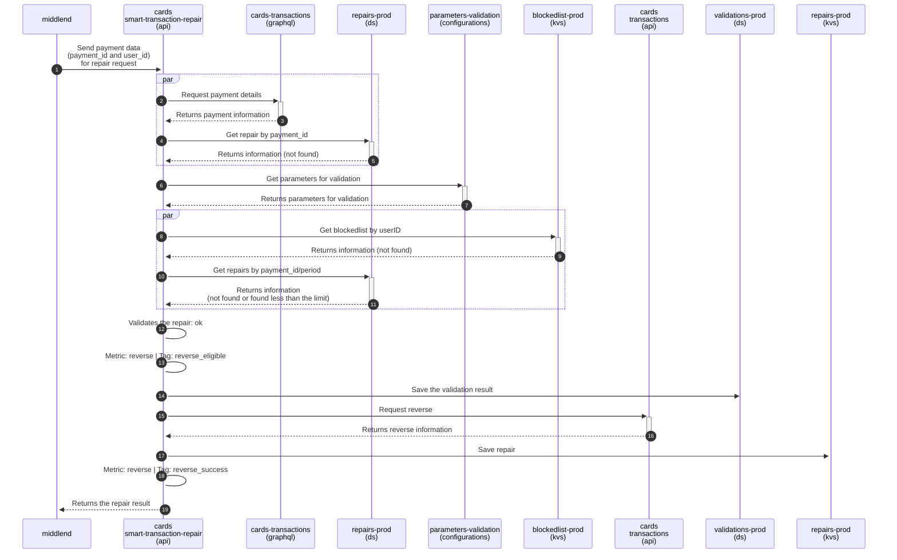
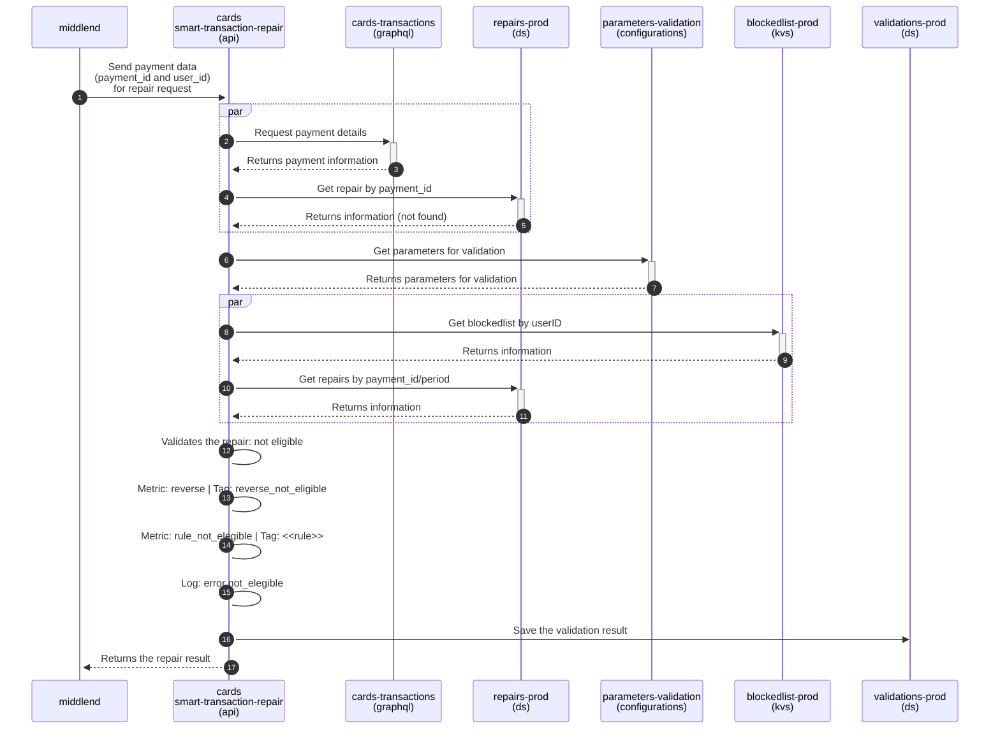
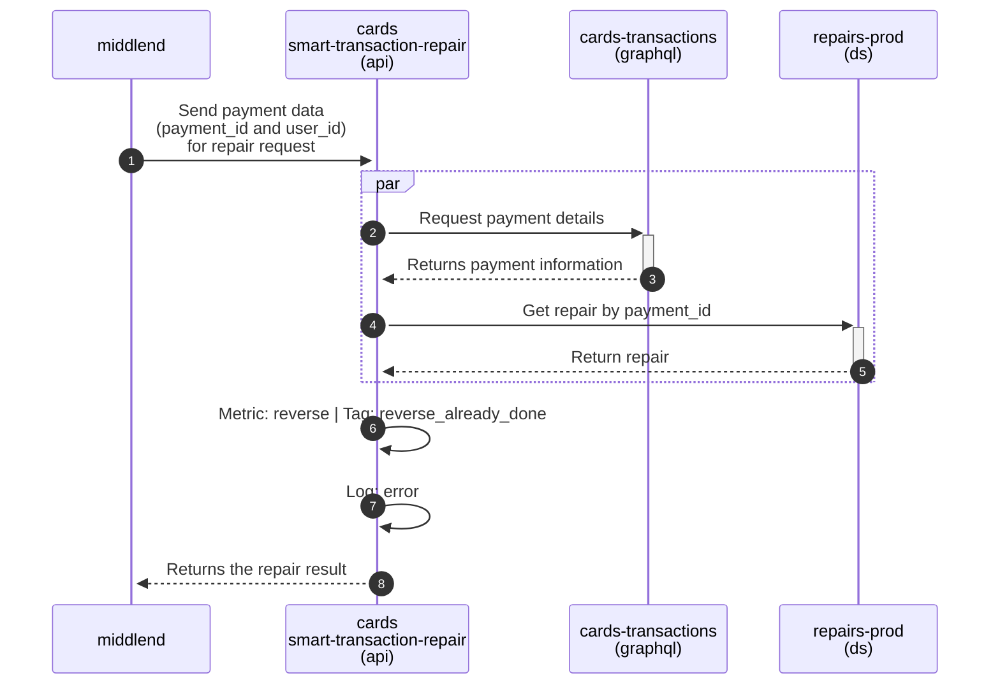
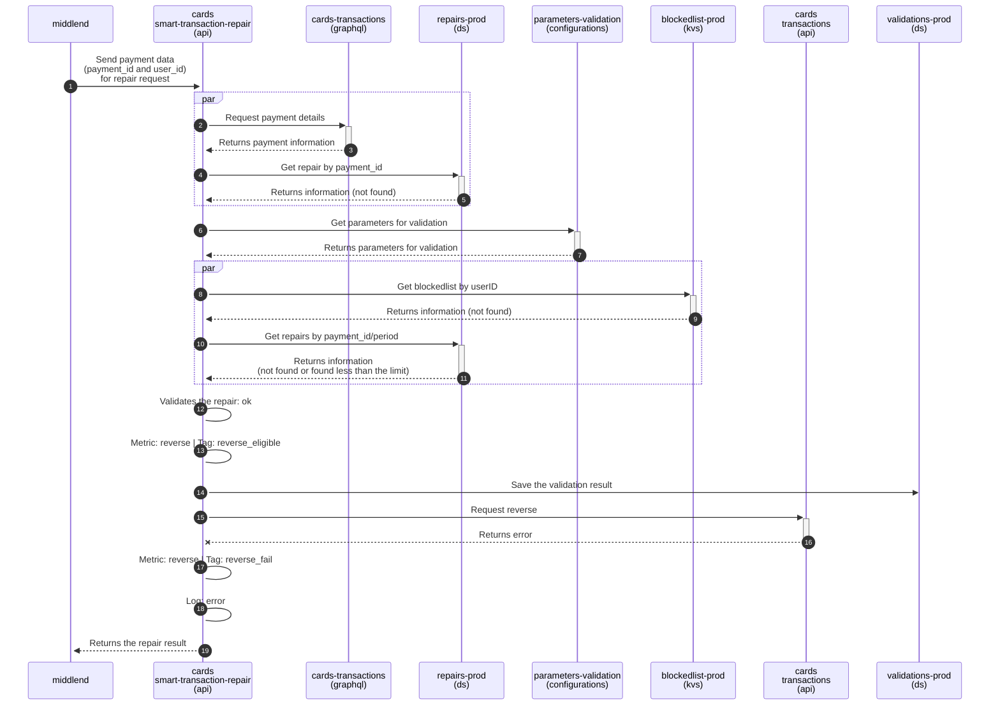
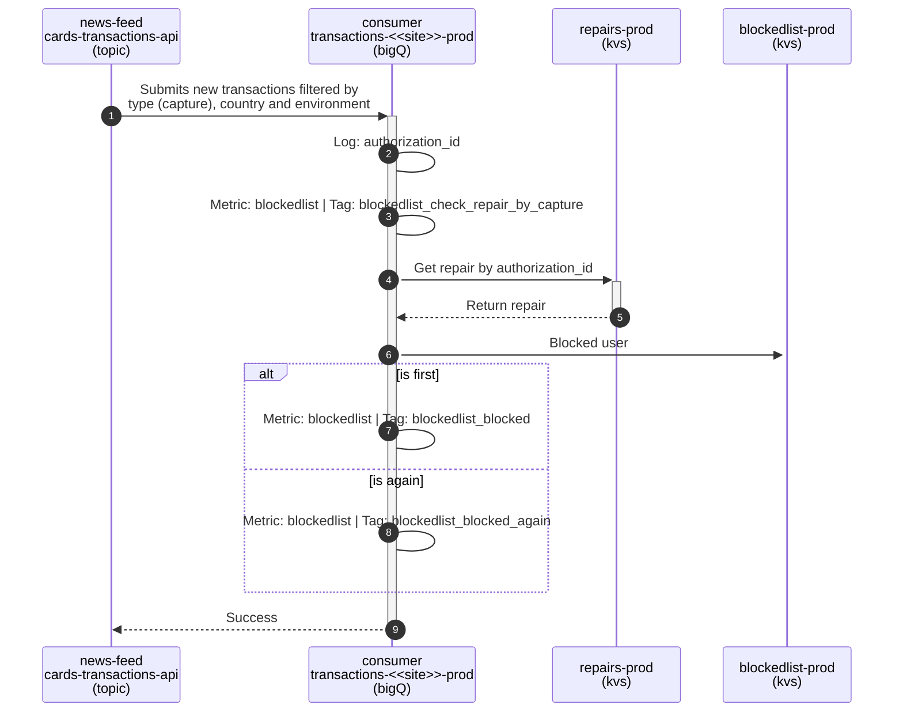
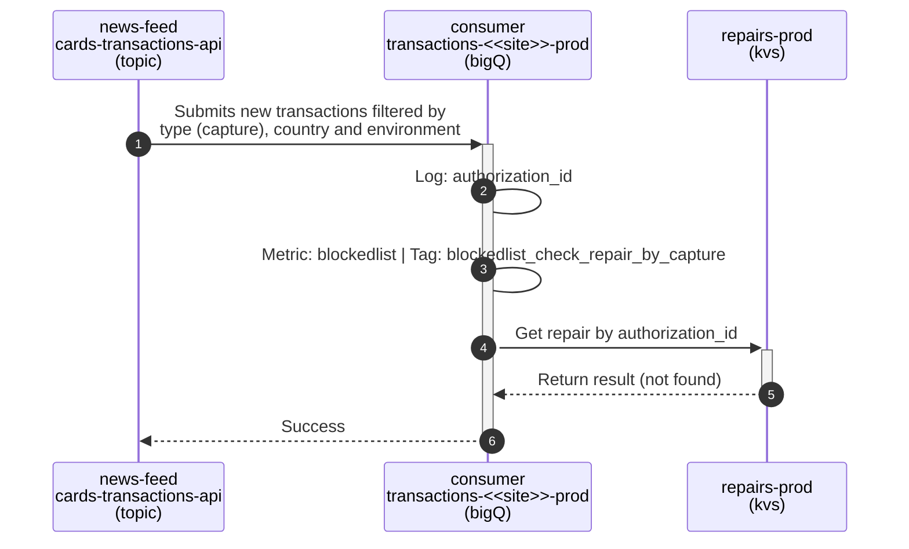
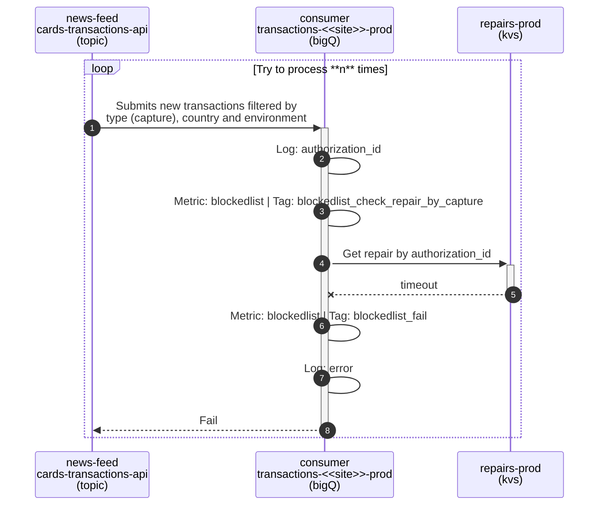

Leia em [Português](workflow.pt.md)

# Sequence Diagram

## Flow Repair
 

### Successful repair
This scenario describes the sequence of an eligible and successfully reversed repair.

> If you don't see, [see here](https://mermaid.live/view#pako:eNq1Vk1v1DAQ_StWTlvRbKCgtlqhikMlxKGXFnFAkVaOPbtrNrZT21m0Kv3vjBMncbL9oBQukT9m5s08j198lzDNIVkkFm5rUAwuBV0bKnNFa6dVLQswucpVRY0TTFRUOSIF5yUoTqjtx2MLAxUVxu8zarj9WJjswko0SJ2hylLmhFZpa9VszmgljsYxMItqc1v2QWLXNuIsmEwcuV22ka33DcO0Mpq3XtxOHHBMJThoHYZZuqOl4NQDtp5Mq5VY16ZZmkbZ7uyyKDXbAi-FdT5UNI3w0XDiGlc2Ju2w5kOisN4h0cY_mj5Vt8_4SabaTHNVCrUN2wvCqd0UGjMkn8jGucousoxW1RwBKdfrze2caZn1VpkTp6mUP1K2LyaRVrXZR0F-QjH3S6zUNZ8LnbXH_ljfZLaWuLUPQYdTf3VgbjML1LBNdnZ-9uH0PCAMjfFqhFEjZZbpCjJPe0CatNKr4TBeBlw4X8_JyXmoLoDFLfanSLFPih15eBZRC_6v84ja958y9P7tu56hXPVil15cvOlb98avVHQvwV9A7HzS3BgyC2tLgeqIJrUFg-OjsL3SptNG4_XWuuZG5iosNhhB1RbkujUZcMBRUVqSq04bU3RI-6SuwdVG2d5eKMSTzSGMEeK78hl6uS72ZEg_V5GOPowTxSczpR2WVyuOitH8D2LA-Op4wEhxPSVDszR0dFuPVfeU7xj34CJ58FiksWR_RF8uczXV7xfW_Dy_dkxwVoER-qU8t8LcAxNkoB2UYC1xG6rwA6QUUriDk-gjf2tJA9sYd6t6-5DtFTgj2ALnO-QcyC_yla776RJKsRZFCTEDBwJwQ3fQQA2rGMDWpRsTN9airv8DVK5G_8mHueqyfLT3R6rR5NXO_qJ0WzOGrA-eDUAnGENOA8eh6OQ4kYDZCY4Pr7tcEZInaCQhTxY45LCinpokV_do6h9iN3vFkoUzNRwndeWPLrzTukUvXtpctW-55kl3nOBP_rvWaLKipYX73wpMpQ4)

---
 

### Repair not eligible
This scenario describes the sequence of an ineligible repair.

> If you don't see, [see here](https://mermaid.live/view#pako:eNq1Vk1r3DAQ_SvCpw2N1xBKEkxYegiUQnNJSg_FsMjS7K4aW3L0sWVJ-987kmVb6yRtSuhNGs2bp3mjGfsxY4pDVmYGHhxIBteCbjVtK0mdVdK1NehKVrKj2gomOiotaQXnDUhOqBnXxx4aOiq0P2dUc3NV62JlWnTIrabSUGaFknnvFQ4XtBMnxzHwFt3uoRmDpNA-4iK6zIDcrPvIxmPjMu-04j2KmxkA17QFCz1g2uV72ghOPWGPZEpuxNbpYJpHud-bdd0odg-8Ecb6UMk24UfHpzeeqMIlku385pVshLyPeZWEU7OrFQpEPpCdtZ0pi4J23RLRlKvt7mHJVFuMXoUV53nbfs_ZoZ5F2jh9SIL8gHrpTaxRji-FKvoqvFTGwrgWjw4x6FSENwfmpjBANdsVF5cX788vI8NUpzczHNW1MEx1UHjVI9Ossm-mw3gFcGF9PmdnlzG7Sbik-P9BvEqO_ZuvVu_G8t95S0cPLfgXia-HhEdHFtG2Ftjw6OIMaFyfxOON0kO7az9CjA1vu5LRGDhio5bktneZeMBS0RhSyaHdcwTk46VuwTotzegvJPK1QZtjhvS9fYRxAtUHMl2_ksloeJ4niU8WUllMz0mOXRdGXEqYPj9PmAwRL8lUwyDHcPRSdn_CHvM-eYyePJ07mLIv0afrSs5H0l9zfo2m5ljUogMt1D9qO9dz9P3apw6G2B2MVl8IaMRW1A08h7oBqwUrcb9HDYH8JF_odtyuEb5-Fdw1gzME5yHQ1ZU_Wq2eA39W6ABaY91SaKrkk56-o3sICU5WjGdcYydYqMDQqZOIkywRkZ1mLaCsguNH_LGShFQZOrVQZSUuOWyoj5tV8he6-o_63UGyrLTawWnmOq92_OYPRj-blL7p_wvC78Fpht-pb0qhy4Y2Bn79Bk4qA40)

---
 

### Already Repaired 
This scenario describes the sequence of a repair attempt (which has already been successfully repaired before).

> If you don't see, [see here](https://mermaid.live/view#pako:eNqlVDtv2zAQ_isEJxu1rKVIAqEwOgTo0ixJp4KAcSLPFlPx4SPZQkjz30s9LNlBMnU73n333ZsvXDqFvOIBTwmtxHsNRwIjLKTobDI1krDCeqCopfZgIzNaqRatYhBm-RpB6EFTb5dAKnypqdwFkwFFJLABZNTOFiNqMK7A6_U1R87CN6d2Jrl0HRlXE-SNowr7kTn0vpNYeHJq9FJh3VfUavtrslZMQWhql8Owr6yJ0YeqLMH7rYIIyh2b01Y6U86oMuqbwpjnQnb1G6ZDou6C5A_W214lW5fUVrtyrOWjZpQhmWzqJtKllP8mVqEMCCSb8vbu9vPNXd8CYedRFrvdp7mGp17joTPYtzO3gA2dY6tJt9d59hmSAlKW15P54Og8eeq3KcRhMMJOyiHGNLOKPY6QJQ5G0G1gwp4nX2SHYk7qEWMiG2a8tjmegb7G6wiXTfuG8zLWHVvSF_ZiS96LMz2FHXZ7oZ9hDxhJyyq_fyMFZH_ZDzjOzz20hKC6vXIW3_X_7jIaidxFf4b0zyNZKo4NLn0NqY18ww3m2rXKh_siLGOCZ5BBwassKjxARgku7GuG9of81FnJq0gJNzz5PNLznZ-VqHR09DD-BcOXsOH5mn46lyEHaAO-_gO2soOP)

---
 

### Fail
This scenario describes the sequence of a failed request.

> If you don't see, [see here](https://mermaid.live/view#pako:eNq1VlFr2zAQ_ivCTymrYyijLWGUPRTGYH1pxx6GIMjWJdEiS64kZwtd__tOtmzLdrutK3sJ0unuPt135y96SArNIVklFu5rUAVcC7Y1rKSK1U6ruszBUEVVxYwThaiYcqQUnEtQnDDbr8ceBiomjD8vmOH2XW6yK1uiQ-oMU5YVTmiVtl7N4YJV4mScA29R7e5lnyQObTMugsskkNt1m9n62LBMK6N5G8XtJADXrAQHbcCwSw9MCs48YBtZaLUR29o0pmmW_cGuc6mLPXAprPOpom2Ej46T0LiyMWnzmudEYb3DRZv4aDutmyop1D6wsiKc2V2uEY68JzvnKrvKMlZVS4xmXG9398tCl1nvlTlxnpblt7Q45pNMm9ocoyTfIV96UyF1zZdCZ20PnxuCzNYlHh1D0qGFr07MbWaBmWKXXVxevD2_DAhDl1-NMJqKzBa6gsyzHpAmc_FqOMyXARfO13N2dhmqC2DxvPwtUhyT4njNexHN03_oB1W9oKRXV2_6ibrzloodS_BDjgNJmjkmi2BbC1QgdKktGFyfhOONNp3-GK9p1jWfC1XB2GAE5ViR29ZlwAHHhLSEqk5_UgxI-0vdgquNsr2_UIhXNtyMEeIR_gC9JOZHMlyfqkirnsaJ8pOF0g7LqxXHD7nR3BgwnmgPGKmap2ToYUNHd_Rcdb-LHePO5tuDx0KIJfsWfbymaqqRL6z5z_zaMcFZBUbol_LcymUPTJCBdiHBWuJ2TOEPEClK4Wad6DN_aUkD2zh3Vr1_yvcGnBHFCvcH5BzIT_KZbfvtGqTYilxCzMDsu7xjB2igBismsLV0Y-LGEtHNf4CiavRflKY_5lSBMdr8QxUb_LCeCvuk0WmStLlpJwsD9MBkKC05TUrAvgmOT5gHqgihCTqVQJMVLjlsmCcgoeoRXf2T5u6oimTlTA2nSV35BoUXT2f02qrNTfsqah5Hpwn-z37VGl02TFp4_AUxZGFG)

 

## Flow Consumer
 

### Blocked user
This scenario describes the sequence of a user lockout, where the user made a repair, and subsequently the transaction received its capture.

> If you don't see, [see here](https://mermaid.live/view#pako:eNqtlEtv1DAQgP-K5dNWbJpSDq2iJSCExIUeYDmhSNHEnt21NrFTe9xqKf3v2Em2csoiIbXJxY-Zb56eBy6MRF5wh7cetcDPCrYWukqDJ6N916CtdKV7sKSE6kETI9MrwcAxjfcu2yDKVWPzUoCVLiML2oEgZbTLoFfD1WJQOZtjRJDwHdpIOq4H6RlitXKKsCyz3prRzqJR22_PWPs7V1vsQVkXcdMy0QkCJ1Sa1og9ylY5imrJ9i_VSrdK78fYC7bx9sA-sh1R74o8v8fmPB6J1nh5rkx-Ohd58Pw2HxAuR6logh6j_1-u60IcKT0bAx74Hwia9xcTOcnLi-GBNTidX11fvbt4mzsEK3aJoSR9r2rs8vL6yVj8x_7LyvJNkrm1bzpFQ0-yNO9so1pCi5I1BzYUlNGhR7YQ0JO3eLYMEK8peAtaMtR3yhrdoQ7FeerQrEwsfTXbgoXXsTNW_YJopFbyX8I3SDY2TNppv9kP2M6OarFDsZ8qVTeHenJuRg3hzsr5BWlq9Bjac4dYpdNHkQX9LPHrOwa-nvRPmZkV89O4Yd7FaQAtMRUTa11IEgvfi2Kf1pXG1mEEwxaUfj1wPfFQz6o0JGR6zmsvBDrHlzxcdaBkGIgP0YOK0w47rHgRlhI34FuqeKUfg2gckOuDFrwg63HJfS-BjvPzeBh72NibccYOo3bJw_j5aUwQ2UCI-PEPkxUFpQ)

---
 

### Not blocked user
This scenario describes the sequence of a non-blocked user, that is, there is no smart repair for capture.

> If you don't see, [see here](https://mermaid.live/view#pako:eNqlk01v2zAMhv8KoVOCxXWHHToYmbfDgF3Ww9adBgMBLdGJEJtyJapF1vW_T_7I4BQbMGA3gSIf8uXHk9LOkCpUoPtIrOmjxb3HrmKM4jh2NfmKK-7Ri9W2RxYQ11sNGIDpMWQNkdnWPi81ehMy8cgBtVjHIcPejl-rMWR9idHJI3bkB9L5PXpfILbbYIXKMuu9m_Ksarv_8oJ1fAg7Tz1aHwbc_FzEJIf1oKPi1vJxklBAE_0JPsBBpA9Fnj9SfTWYdOuiubIu_7OkPBVwn4-IkJOxMkPPIv6VG7qkYEnPprpH_nvB-t31TF7I-294Yo1F5zdvb95cv84DodeHqTfTZLOyfLUQcxfrzso4bVi2AhrbCnkyUJ9g7DLIqSdYaewlelpvEiSypGqRDRA_WO-4I079-j37rFxk-uz2BaS9Ozhvf-CQZGfN35xvSfwww7p1-kimtUHgJ3zD_YVppw-kj3PzdvVpNxd3QU1yLzr8iWReoUHay4Kg4uW6ZSk-W9T1lRKfU3yIrcCKnUCT2mDWy5RjzLyEd1FrCkFtVPrq0Jp0jU8VA1RKDtRRpYr0NNRgAlaq4ufkOlzn3Ym1KsRH2qjYG5Tz8Z6Nw5idv50OfLzzjUrn8t255NJgG-j5F0R8d2Q)

---
 

### Fail
This scenario describes the sequence of a failure process.

> If you don't see, [see here](https://mermaid.live/view#pako:eNqllMFu2zAMhl-F0CnJ4rrDDh2MzNth2C7rYWhPgwFDluhEiE25EtUu6_rukxVncIptGNCbIFMf_5-k-SiU1SgK4fEuICn8aOTWyb4iGdhS6Bt0FVU0SMdGmUESA9vBKJAeCB981iLqTePyUkmnfcZOkpeKjSWfycGkT4v0ZHmOUTEi9OhG0umcos8Qm403jGWZDc4e8ywas_36jLW_97XDQRrnR9x0nL2JAcvRR0Wdof3RQgFtcAf4ADvmwRd5_oDNxXilOhv0hbH5ny3lUcBdnhA-R214gp5M_C_X99HBnJ4ddSf-e5bNu8uJPLP3YnhkJdH51durN5evc4_SqV2qjLUD3EY4W4iVU-g9rFa0WgGbHn1Fx8ZnZflq5vUmNL3hNAwwrxS0pmN0qKE5QGoC8GFAWCg5cHC4XEdIII75JGlAujfOUo8Uy_l7NLJylumL3RYQx3JnnfkhxyS10X8LvkZ2Y4ubzqo96s54hp9wK7dnV7XaodpPta2bQz2JO6NGu2cN-Iw8Tdho7bkgqGg-jVn2PZvJGitpA79QdStN988qoXPWzSOii-w09Z_SayQt1iJ-7KXRcQE8VgRQCd5hj5Uo4lFjK0PHlajoKYaOC-HmQEoU7AKuRRi05NO-OF2Ok2Xd9XGnpNWyFvEP_WZtDGll5_HpFznBoYA)

