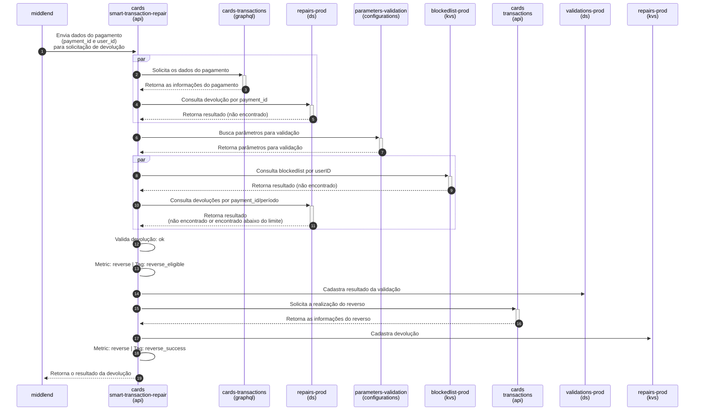
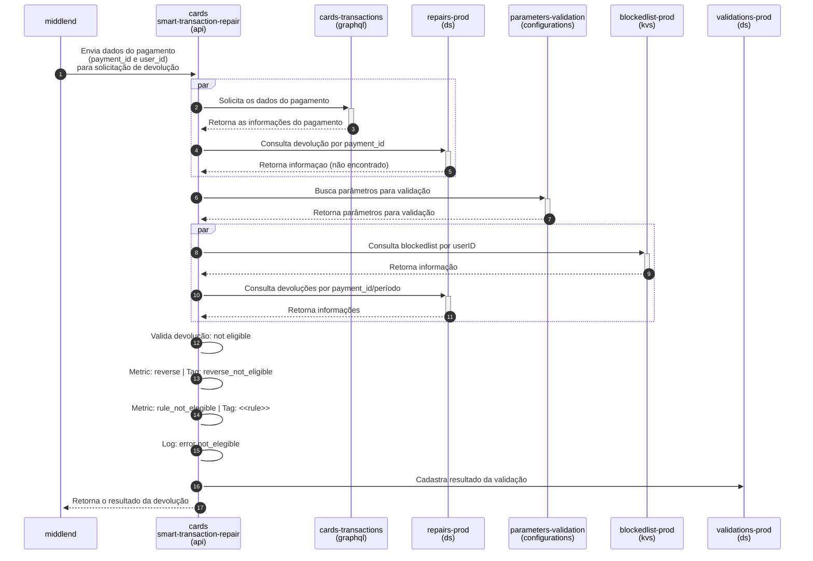
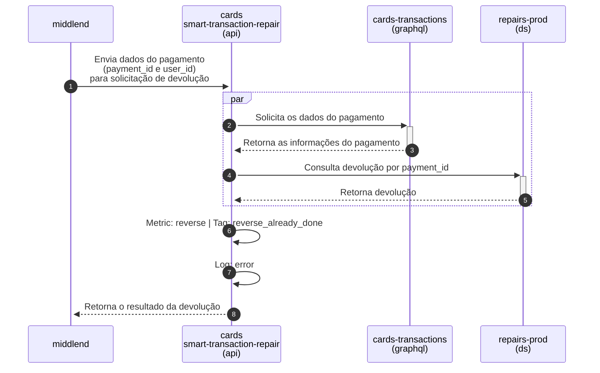
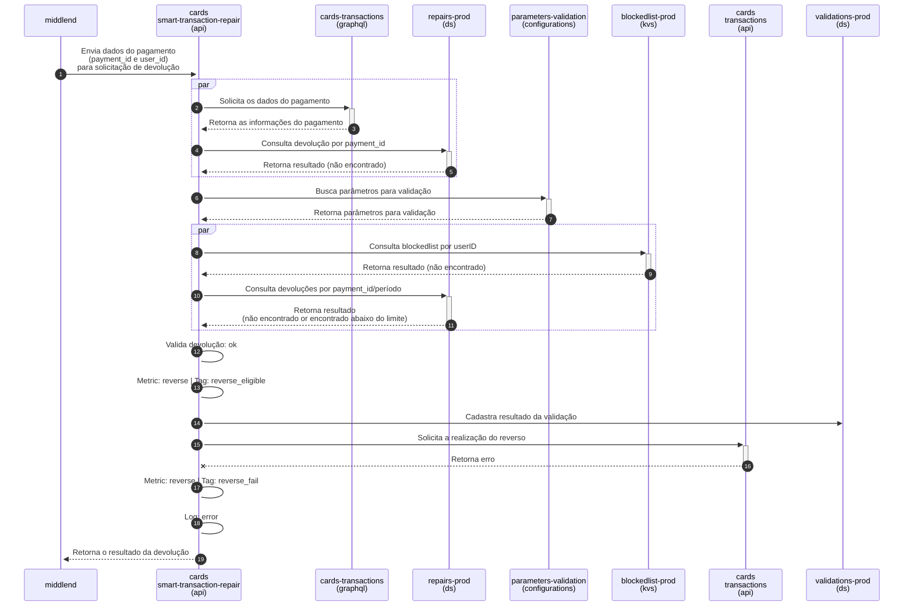
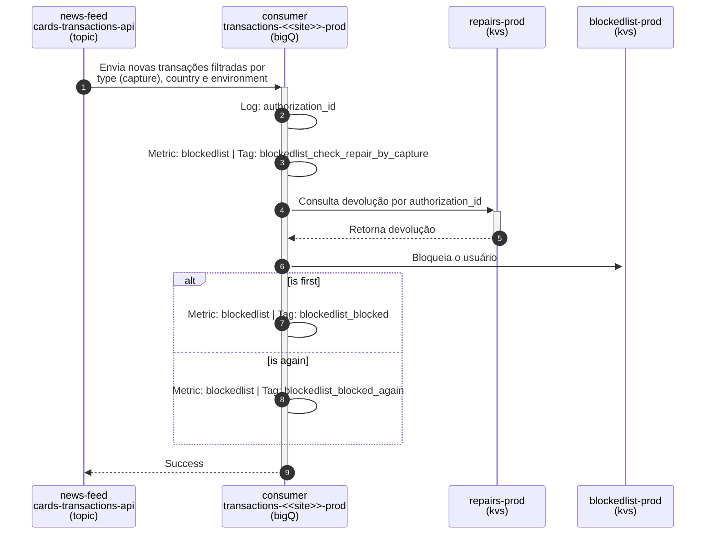
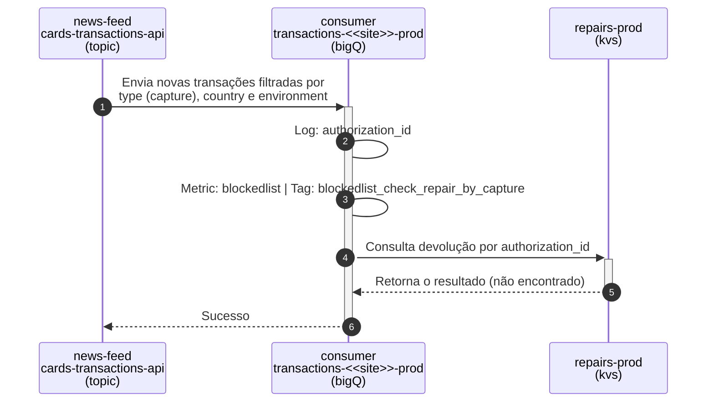
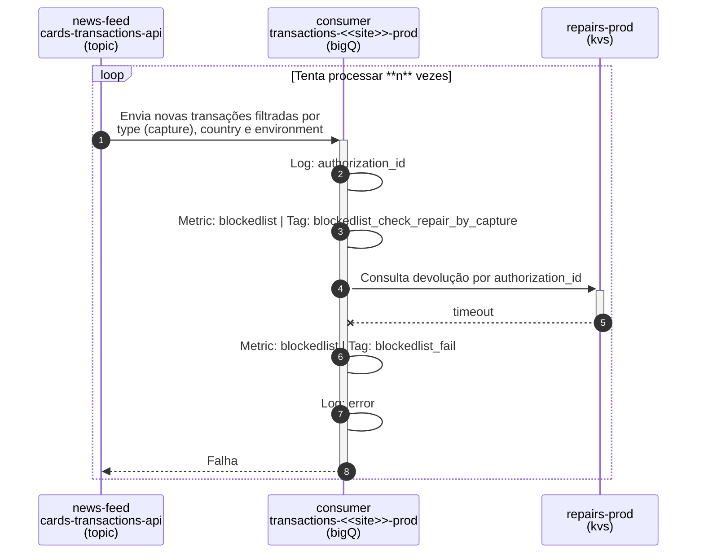

Read in [English](workflow.md)

# Diagrama Sequência

## Fluxo Reparo
 

### Devolução com sucesso
Este cenário descreve a sequência de uma devolução elegível e revertida com sucesso.

> Caso não visualize, [veja aqui](https://mermaid.live/view#pako:eNq1Vs1u1DAQfhUrp1Y0GyiorVaoQrQcOPRCEQcUaeW1Z3fNJp7UdhaW0peBAyeOPEFfjHGSTZxsKS0FKYfYnm---bcvI4ESonFk4aIELeBU8bnheap56VCX-RRMqlNdcOOUUAXXjuVKygy0ZNy2_30JAwVXxp8LbqR9PjXJsc1JIHaGa8uFU6jjWqo63OGF2u3rICuKxUXWKgmhtcadRmQAlHZSa7Ye2_zGhUFZo6QdAOif5-CgBnSreMUzJbknrJEC9UzNS1NtDbUsV3YyzVAsQWbKOq8qWAb8JDiAhp71g7bt83agyN_O0AofLG_z21t8a6RqS1OdKb1sjsdMcruYIlnIXrCFc4UdJwkvihERconzxcVIYJ60UolTB3Gef4jFejrQNCvNOlDyEaYjvyUyLOVIYVKn_Xd1k9gyp6N1o7TL-oMVS5tY4EYsksOjw2cHRw1DVxgPZugVUmIFFpD4sDdMg1J6MB3pS0Aq5_3Z3z9qvGvIwhK7K1OIiakit3MRlOD_ykdQvv80Qk8fP2kjlOp22MXHx4_a0n2lV4pTK0i0TCKVxpxKQztkVeOwnYKv_XqiJANWWjD0t9sc-jpiFjNqQ8evv19_QyaBvhVmZbWsujTVzRCteJtJN2bnDY554m36VG_GZky4uLX3DTg0mvs2V3qGJvfEP6GP7lOGDXVCaSwzYg2sZAUa1vmZ6mDu3kxuoFJClDvaK6DrBjUlQyJNmeoOCfnDdntZWsH9zvVX2jJYT-lmznUx20zxm-n_CO_zbzVhG4Rwyvsg-Py-Pk318Ab4iyjcPQE-ef0MJAWY6x8o8V6pqCf9wBJGioMVn3L1CX2tZCpXDrbS1ep_V4U0LJMxw-VNkmeUCCXGtF5RyoB9YW_5vF1OIFNzNc0gDMnWXDnhdM2QiYE7cpDWMKD9Sdd2kocT5POmF7ExgtC9i_nuHdXih_XU5XNjea_t7x0lWwoB1nbIimkzsjojsR-hgDTai3Ig45WkN-BlqhlLI7eAHNJoTL8SZpxwaZTqKxL1b8LztRbR2JkS9qKyoFxsnoybTT9H0ZzVz8rqdbkX0XvjPSKJzHhm4eoXVhHtHA)

---
 

### Devolução não elegível
Este cenário descreve a sequência de uma devolução não elegível.

> Caso não visualize, [veja aqui](https://mermaid.live/view#pako:eNq1Vs1qGzEQfhWxJ4dmvRBKEpZgSpMeCs2lKT2UBSOvxraaXc1G0rqYNC_THnrqMU_gF-tof7Vrl6SEgg8aab75Zr8ZjXUfpCggiAMDdyWoFK4kX2meJ4qXFlWZL0AnKlEF11amsuDKslwKkYESjJtuPfTQUHCp3XnKtTAXCx3NTE4OodVcGZ5aiSqsvarDCS_k0TAGZVGs77IuiA-tI04alxFQmHkd2ThsswwLjaJGCTMC0JrnYKEG9Fa44ZkU3BHWyBTVUq5KXW2No9xuzHyRYXoLIpPGulCe6fGT437GPVWVhGeOM09UJtVt810xE9ysF0gCsTdsbW1h4ijiRTElNBe4Wt9NU8yjziuy8jTM869hul2MIi1LvfWCfIPF1G2lGZZiKjGqq_C3MkamzOlo2wTti_DiwMJEBrhO19HZ-dnr0_OGoa_TixkGdY1MigVETvWGaVTZF9NRvAiEtO57Tk7Om6_rhfOK_x_ES1R3f8PZ7FVX_ndqIzm1k0DDBJK8K5JXWWRV77FJwbfOnkvBgJUGNK2OmkNXC2Ywo4a2fPdr9xOZAPptMCsrs-r3RDVzoeJtLm_Mbhocc8T79IlqJ0FIuLDL9yNY1Iq72yLVEnXuiB9hiB5S-k15SeqWGbF6WbICNeu_M1HeKDlM3jFzZBPlQtAMRUWFEEh3tRqMfgZ-074tTcrdzu4HbWmsR09z9XvV2tF0OIEn4UP-vVbuZPBHl5PBVfj9VaLGY-0JHSra52vu6jUUPSpA736jwH9R38UZq915f64U8escM4WWQSZXcpHBIcw1KSrTmOwNaQ_sO_vEV505J_j8WfAya52hcm4DsYsLdzabHUJ_QPIArUkXH-vrujcmLjmNeGo7ClJJTJdAjJqhRVdlaWdALyYOoZ5cwXGQA-ksBb0T7hPFWBLYNeSQBDEtBSw54ZIgUQ_k6t4NN1uVBrHVJRwHZUFJts-KdtONP9TX9dOjeoEcB_RX-AWRXJY8M_DwB_2XOm0)

---
 

### Devolução já realizada
Este cenário descreve a sequência de uma nova tentativa de devolução (que já foi devolvida com sucesso anteriormente).

> Caso não visualize, [veja aqui](https://mermaid.live/view#pako:eNqlVEtu2zAQvQqhlY1a1qZIAqEwCqTdNZumq4KAMRbHFluRQ5OUCyHNabroCXqCXKyjj2UpTVcBtCA1782bLx-SghQmeRLwWKMt8IOGgwcjLdSRbG126KWV1oGPutAObBRGK1WhVQLCeJ4jPDrQvrUX4FV4t_PZJhgGpNGDDVBETTbtUZ1xAU4v5z44Clceq9HJlNp7XAyQZ0QVtr3n0HKHY-o8qZ6lwrLNqNL2-2DNhYJQ7ohlxHtRxuhCnmXg3FpBBEWH8rguyGQjKov6KjXmW1o0u2ee9rVvJk5-4G7d_ioqqtVaU9bn8r9iZKE2bGoGp5dUXu1YhSwg-KLMrm-u317dtCWQdmxlutm8GXP4aE8auCaKglAkHBzAoI0kugKKhYOmvW-1EijqgJ5Py8HInQARqOJuRHj6_fSLhEL-TlTV3bVrlrTDiHS6Qx9zcT_wRCv8r7y056FImZeO8X7GSN5C225t9-RNK_wH5-y55LSytzxQdcWqkyiFIy8ueUo7maqXxWcpdhtx0RvBdxi9LnK-n9AHFD_FFziM1y1UHkE1W0UWX-R_Ikaj9zSpYJfPuZGXeIhJXVpcBDULL1klBrlIWvHeP0grhExiiQZlkvNR4R6YJxNpHxnavgP3jS2SPPoaV0nteCnOz8T5JyrNqnf9U9K9KKuEl_ErEUP2UAV8_At_A6Ip)

---
 

### Falha
Este cenário descreve a sequência de uma solicitação com falha.

> Caso não visualize, [veja aqui](https://mermaid.live/view#pako:eNq1VsFu1DAQ_RUrp61oNlKF2ipCFaLlgEQvFHFAkVZOPLtrmnhS21m6lP4MHDhx5Av2xxgn2ayTLKK0QtqD7cyb55k3M-u7IEMBQRwYuKlAZXAh-ULzIlG8sqiqIgWdqESVXFuZyZIrywopRA5KMG66dd9CQ8mldt8zroV5kerozBRkEFrNleGZlajCxqr-OOGlPOj7oFuUy5u8c-JDG4-T1mQAFGbWeDYO2y7DUqNoUMIMALTmBVhoALtduOK5FNwRNsgM1VwuKl0fDb1cr8wszTG7BpFLY50rb-vxk-EA6kfWT9o45nGiKN7dRWu8tx3Gnahcqus2KzET3CxTJDr2ki2tLU0cRbwsp4TmAhfLm2mGRdRZRVYeh0XxKczW6cDTvNJrz8lnSKfuKMuxElOJUaPhn4ogMlVBn9at052ET3YsTGSA62wZnZyePD8-bRl2Kj-ZoVcVkcmwhMhlvWUa1MWT6chfBEJaF8_R0WkbXUvm18tDmXxMSOU11sKrp_-gR6K6gRKenT3rKuq1WklOFSrQMIGk2IIUUxZZXc5sUvK128-kYMAqA5pWB-1HJy8zmFOPWL75sfmOTAD9VphX9bZuoUS1g6rmbadJzK5aHHPEY_pEbUdTSLiwu-87sKgVdw0o1Rx14Yh_QR_dp_Tr_JyyW-XE6t2SlajZLs5EebNtP7mG2glRTpRzQCMdFckgkJq_ntM-v98FryqTcXey-UZHGptJ2M6SXc62k3I__V_hff5Rb3RJ8CepS4LT981FooZT9hFZeLgATry-AlEJevMTBf6TFM38HdyEkWNvx1Mub9HVSi4LaWEkV-f_Q51Sv0xihtf7LC9JCJnFtF-RZMC-svd80W1nkMuFTHPwUzJq93NO05-u6IUjBrL6Ce0PoK6THJwgX7a9iO0lCN378wvD23EiQWt8RHhzLvN9sLdIRs6nV4z13bdjaMeM_ai9lAeHQQHU4lLQ2-kuUYwlgV1CAUkQ01LAnBMuCRJ1T6buLXW1VlkQW13BYVCVlN_tU2t76IY66svmOVa_yg4D-oP_iEgmc54buP8NvsagEg)

 

## Fluxo Consumer
 

### Bloqueio de usuário
Este cenário descreve a sequência de um bloqueio de usuário, onde o mesmo realizou uma devolução, e posteriomente a transação recebeu sua captura.

> Caso não visualize, [veja aqui](https://mermaid.live/view#pako:eNqtlEtu2zAQQK9CaJWgVpSmiwSCqxb97JpFm64KAcKIHNuEJVLhx4Gb5jBFFzlBT-CLdSjJAZW6QIFE2vAz8-bLuU24FpjkicVrj4rjBwlLA22pwDutfFujKVWpOjBOctmBcszpTnIGlim8sekCUcxrkxUcjLCpM6AscCe1sil0sr866lWOpxhOEr5FE0j7dS89QcznVjosirQzerBzVMvl50es9cZWBjuQxgbcuIx0SOCASt1ovkbRSOuCWrT9S7VUjVTrIfacLbzZsrds5Vxn8yy7wfokHPFGe3EidXY4Fxl5fp31CJuhkG6E7qP_X65tKY6Yng4B9_w3DurXpyM5ysuT4cTqnc7OL85fnb7MLILhq8hQlL5nNXZ2dvFgLPxD_6VF8SLK3Ee1kcCU3lAdB97ufvcbLVvIhvaCjjttWF9S5rYdsiMOnfMGj2eE8cqRv8iQMEarFhUV56FD0yKy9Ekvc0avY6WN_A7B6UqKfwlfojOhYeJO-8G-wnJyVPEV8vVYqareVqNrEyqFOynn-3DVOGACN7rxFO4v3cf42DdWqvh9pIRKIxe_oNNGTTCH7E6q-67RNC4o4Zp563c_jSQdaByTIeHGUvIYfU_KybguFTYWAxiWINXzgauRh2pSvT474zO_8pyjtcksoasWpKBBeRs8KBO3whbLJKelwAVQIcqkVHckGgbn1VbxJHfG4yzxnQC3n6v7w9Db2lwOs7cfwbOExtI3rUlkARTx3R_MxRO0)

---
 

### Não bloqueio de usuário
Este cenário descreve a sequência de um usuário não bloqueado, ou seja, não há devolução inteligente para captura.

> Caso não visualize, [veja aqui](https://mermaid.live/view#pako:eNqlk8-O0zAQxl_FyqkVzWYRh0VRCUjAjT3AckKRook9ba0mnqz_dFWWfRoOPAFPsC_G2ElRugIJiZs9Hv_8feOZ-0ySwqzMHN4GNBLfadha6GsDwZMJfYu2NrUZwHot9QDGC0-DlgKcMHjn8g2iWre2qCRY5XJvwTiQXpNxOQw6HS3SleU5RnJG6NFG0mmdss8Q67XTHqsqHyyN7yxavf34hLU_uMbiANq6iJuWszucsIw-atNpsx8tlGIT7FG8ETvvB1cWxR22FzEkOwrqQlPxZ0sFC7gtEsIVqLSfoCcT_8p1PTuY0_NRd-K_9tC-upzIM3v_DWdWEl1cvbx6cfm8cAhW7sbajD-bV9WzmZn35qBBGDpwYUfe44_Hn-jERne8VxweyIpUZ-GPA4qFhMEHi8sVY4LxrBcFMsaS6dFwvX7_fV7NXvpA21Jw3-3I6q8QRTda_S35Gr2Nf9h2JPeoOu28-CY-w_Ys1Mgdyv1UvKY9NpO0MyrbPavw23jUeRAKD9QFtvudksen2kRt5p2XMyqfSfyEnqwBQdyQCahILEyEYXw-Fo-WcyXp_tSbN0Gic5StMj7qQSse0vvaCFFnfoc91lnJS4UbYHKd1eaBU-PQ3hyNzEpvA66yMCjwp5k-BePvk70e5z6N_yrjKfpCxCkb6Bw-_AIqU4Oh)

---
 

### Falha
Este cenário descreve a sequência de um processo de falha.

> Caso não visualize, [veja aqui](https://mermaid.live/view#pako:eNqllM1u2zAMx19F8CnJ4rrDDh2MzBuwj9N6GNbTYCCgJToWYlOqPtKlXZ9mhz3BnqAvNtpOBqfYhgG9SRT1E_8kxbtEGoVJnni8jkgS32nYOOhKghgMxa5CV1JJFlzQUlugIIKxWgrwgvDGpzWiWlUuKyQ45dPggDzIoA35FKwejmbDlfkpRrJH7ND1pON68D5BrFZeByyK1DozvjOr9ObTI9Z259cOLWjne9xhObnDDvNeR0mtpu0oIRd1dHvxRjQhWJ9n2Q1WZ71JtiaqM22yP0vKOIDrbED4DJUOB-hRxP9yfccKpvR0jHvgvw5QvTo_kCfyngxn1hB0dvHy4sX588wjONkMmTHGiiukAIITJ9F7cGKxoMVC7PAWvRAljbVPi-LZRO572mkQZHac-vHFhx8PP_lCrVveKzZb48RQCRH2FsVMgg3R4XzJmEiBFaFAxjhDHUdQ0u_uSIvJSx_NJhfcmY1x-hZ6WWut_uZ8icH1Va5aI7eoWu2D-CauYHNiWssG5faQ3nW1Xx9CO6Gy3JMavO2PWk6Uwp1pI8v9bgaNj2PjlE17M02_ppMIg-7QxPBEATXo9p8JQ-eMm3qwoPT4Bz5A20BJSCpZJnzagVY8D-5K4nonocEOyyTnpcIaWHOZlHTPrv18-LwnmeTBRVwm0SoIx_FxNPaNZtzlOGKGSbNM-MN-MYZdamg93v8CSLOpyA)

